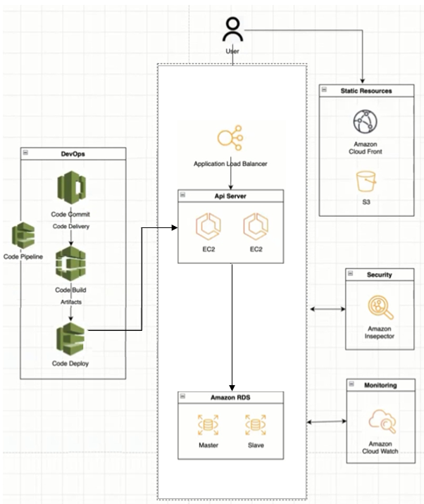
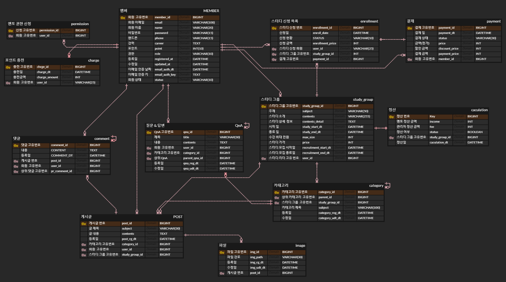

# 온라인 북 스터디 그룹 (Online Book Study Group)

---

# 프로젝트 개요

---

- 스프링부트 기반 웹 서비스이다.
- AWS를 활용하여 배포 및 서비스를 운영한다.
- 온라인으로 스터디 그룹을 만들어 각자 공부한 내용을 공유하며, 논의할 수 있는 서비스를 제공한다.
- 멘토 및 일반 회원은 스터디 그룹 생성 가능하다.
  - 멘토가 개설한 스터디 그룹 : 유료
    - 멘토가 그룹원들에게 피드백 및 Q&A 제공해준다.
  - 일반 회원이 개설한 스터디 그룹 : 무료
- 멘토는 해당분야 경력 커리어가 있어야 한다.
- 일반 회원도 커리어가 쌓이면 멘토 권한 신청을 통해 권한 변경 가능하다.
- 회원 및 멘토는 자신이 관심 있는 주제에 따라 다양한 스터디 그룹에 참여한다.

# 개발 환경

---

## 기술 스택

## 아키텍처

# ERD 모델링

---

# 구현 예정 기능

---

# 관리자

- **회원 관리**
  - 회원 정보를 관리한다.
  - 멘토 권한 신청 목록을 관리한다.

# 회원

- **회원 가입**

  - 소셜 계정 회원가입
    - 카카오 계정을 사용하여 간편하게 회원가입을 진행한다.

- **로그인**

  - 아이디와 패스워드를 입력하여 로그인을 진행한다.
  - 로그인에 성공하면 Access Token과 Refresh Token을 발급한다.
  - Access Token 유효 기간이 만료되면, Refresh Token을 통해 Access Token을 재발급한다.

- **결제**
  - 결제를 통해 사이트에 포인트를 충전한다. (Kakao Pay API 사용)
  - 결제금액은 10,000원 단위로 가능하다.
  - 포인트를 사용하여 원하는 스터디 그룹에 신청한다.
- **회원 정보 수정**
- **회원 탈퇴**
  - 회원 상태를 비활성화 시킨다.

# 북 스터디 그룹

- **스터디 그룹 개설**

  - 스터디 그룹 정보를 수정할 수 있다.
    - 이미 신청한 회원이 있다면 메일을 통해 알려준다.
  - 스터디 그룹 모집 기간에는 해당 스터디 그룹을 삭제 할 수 있다.
    - 이미 신청한 회원이 있다면 메일을 통해 알려준다.

- **스터디 그룹 신청**

  - 모집 기간에 해당 스터디 그룹이 삭제되는 경우, 신청 금액 100% 환불 받는다.

- **스터디 그룹 페이지**
  - 해당 스터디 그룹의 그룹장, 그룹원, 관리자만 조회할 수 있다.
  - 그룹장은 자유롭게 일정 카테고리를 생성 및 수정 할 수 있다.
  - 그룹원들은 각자 공부한 내용을 기반으로 글을 작성한다.
    - 파일 업로드 가능 (S3 활용)
  - 게시글에 대해 댓글을 작성할 수 있다.
  - Q&A 메뉴를 통해 질문 및 답변을 할 수 있다.
  - 멘토가 개설한 스터디 그룹인 경우 글에 대한 피드백을 제공한다.
  - 멘토가 개설한 스터디 그룹인 경우 Q&A 대한 답변을 제공한다.
